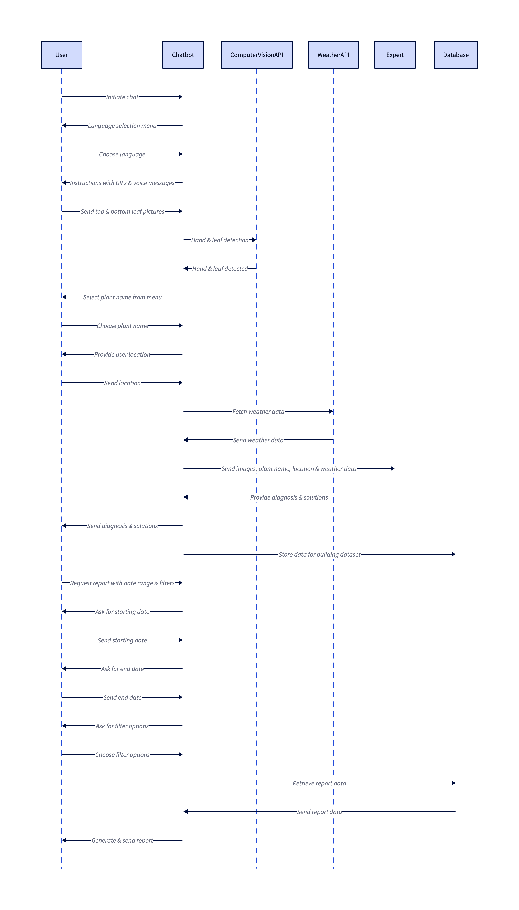

<h1>DeepLeaf FitoFoto : Plant Disease Detection Backend</h1>

This is the backend repository for the FitoFoto Plant Disease Detection project by DeepLeaf, which aims to provide farmers with an easy-to-use chatbot that can detect diseases in their plants and suggest solutions.

In order to collect a dataset to train our AI models, we will firstly connect farmers to agronomy experts while storing images and its annotations in our dataset. When we reach a good amount of data we will train our deep learning models on the collected dataset and replace experts with our AI.

<h2>Below is the sequence diagram of the project's workflow : </h2>

<h2>Below is the class diagram of the project's workflow : </h2>

  

    
Below is a list of apps included in the project:

    <ul>
        <li>
            <strong>Farmers, Experts:</strong> This app will handle the user authentication, including expert and farmer phone numbers, names, and join dates.
        </li>
        <li>
            <strong>WhatsApp API:</strong> This app will integrate with the Heyoo WhatsApp API wrapper and handle sending and receiving messages from the chatbot.
        </li>
        <li>
            <strong>Plant KB (Knowledge base):</strong> This app will contain the plant data, including images for healthy references and solutions to detected diseases.
        </li>
        <li>
            <strong>Dataset Builder:</strong> This app will handle storing the data collected from farmers and experts for use in training future AI models.
        </li>
        <li>
            <strong>Detection API:</strong> This app will contain the logic for detecting diseases in plant images, using machine learning models.
        </li>
        <li>
            <strong>History:</strong> This app will store the history of chats and images exchanged between the chatbot and farmers, as well as experts.
        </li>
        <li>
            <strong>Report Generator:</strong> This app will generate reports for farmers based on their chat history and collected data, including options for filtering by date range, plant type, and location.
        </li>
        <li>
            <strong>Analytics:</strong> This app will analyze the collected data and provide insights for farmers, experts, and researchers.
        </li>
        <li>
            <strong>Admins:</strong> This app will handle the user management for admins, who will have access to all the data collected by the system.
        </li>
        <li>
            <strong>Subscription:</strong> This app will manage the subscription plans for farmers, including payment processing and account management.
        </li>
        <li>
            <strong>Weather API:</strong> This app will integrate with a weather API to provide farmers and experts with real-time weather data to aid in their plant disease detection and prevention efforts.
        </li>
        <li>
            <strong>Web API:</strong> For the web platform frontend.
        </li>
    </ul>

<h2>Technologies Used</h2><ul><li>Django: Python web framework for building APIs</li><li>Graphene-Django: implementation of GraphQL for Django</li><li>PostgreSQL: database management system for storing user data and chatbot conversations</li><li>Azure Cosmos DB: globally distributed database service with support for multiple data models</li><li>Azure Container Registry: secure and private Docker container image registry for storing the containerized chatbot and AI models</li><li>Azure Kubernetes Service: fully managed Kubernetes service for deploying and scaling containerized applications</li><li>Azure Machine Learning: cloud-based platform for building, training, and deploying machine learning models</li><li>WhatsApp Business API: API for integrating WhatsApp messaging into business applications</li><li>Azure Storage: cloud storage service for storing and serving user-uploaded images and AI models</li></ul><h2>Getting Started</h2><ol><li>
Clone the repository to your local machine.
</li><li>
Create a virtual environment and install the required packages:
<pre>

bash<button class="flex ml-auto gap-2"><svg stroke="currentColor" fill="none" stroke-width="2" viewBox="0 0 24 24" stroke-linecap="round" stroke-linejoin="round" class="h-4 w-4" height="1em" width="1em" xmlns="http://www.w3.org/2000/svg"><path d="M16 4h2a2 2 0 0 1 2 2v14a2 2 0 0 1-2 2H6a2 2 0 0 1-2-2V6a2 2 0 0 1 2-2h2"></path><rect x="8" y="2" width="8" height="4" rx="1" ry="1"></rect></svg>Copy code</button>

<code class="!whitespace-pre hljs language-bash">python -m venv venv
source venv/bin/activate
pip install -r requirements.txt
</code>

</pre></li><li>
Set up a PostgreSQL database and create a <code>.env</code> file with the following environment variables:
<pre>

makefile<button class="flex ml-auto gap-2"><svg stroke="currentColor" fill="none" stroke-width="2" viewBox="0 0 24 24" stroke-linecap="round" stroke-linejoin="round" class="h-4 w-4" height="1em" width="1em" xmlns="http://www.w3.org/2000/svg"><path d="M16 4h2a2 2 0 0 1 2 2v14a2 2 0 0 1-2 2H6a2 2 0 0 1-2-2V6a2 2 0 0 1 2-2h2"></path><rect x="8" y="2" width="8" height="4" rx="1" ry="1"></rect></svg>Copy code</button>

<code class="!whitespace-pre hljs language-makefile">DEBUG=on
SECRET_KEY=your_secret_key
DATABASE_URL=your_postgresql_database_url
AZURE_STORAGE_CONNECTION_STRING=your_azure_storage_connection_string
AZURE_STORAGE_CONTAINER_NAME=your_azure_storage_container_name
AZURE_KBS_ENDPOINT=your_azure_kbs_endpoint
AZURE_KBS_SUBSCRIPTION_KEY=your_azure_kbs_subscription_key
AZURE_CONTAINER_REGISTRY_SERVER=your_azure_container_registry_server
AZURE_CONTAINER_REGISTRY_USERNAME=your_azure_container_registry_username
AZURE_CONTAINER_REGISTRY_PASSWORD=your_azure_container_registry_password
WHATSAPP_BUSINESS_NUMBER=your_whatsapp_business_number
WHATSAPP_BUSINESS_INSTANCE_ID=your_whatsapp_business_instance_id
WHATSAPP_BUSINESS_API_KEY=your_whatsapp_business_api_key
WHATSAPP_BUSINESS_API_SECRET=your_whatsapp_business_api_secret
</code>

</pre></li><li>
Run the database migrations:
<pre>

bash<button class="flex ml-auto gap-2"><svg stroke="currentColor" fill="none" stroke-width="2" viewBox="0 0 24 24" stroke-linecap="round" stroke-linejoin="round" class="h-4 w-4" height="1em" width="1em" xmlns="http://www.w3.org/2000/svg"><path d="M16 4h2a2 2 0 0 1 2 2v14a2 2 0 0 1-2 2H6a2 2 0 0 1-2-2V6a2 2 0 0 1 2-2h2"></path><rect x="8" y="2" width="8" height="4" rx="1" ry="1"></rect></svg>Copy code</button>

<code class="!whitespace-pre hljs language-bash">python manage.py migrate
</code>

</pre></li><li>
Create a superuser for the Django admin site:
<pre>

bash<button class="flex ml-auto gap-2"><svg stroke="currentColor" fill="none" stroke-width="2" viewBox="0 0 24 24" stroke-linecap="round" stroke-linejoin="round" class="h-4 w-4" height="1em" width="1em" xmlns="http://www.w3.org/2000/svg"><path d="M16 4h2a2 2 0 0 1 2 2v14a2 2 0 0 1-2 2H6a2 2 0 0 1-2-2V6a2 2 0 0 1 2-2h2"></path><rect x="8" y="2" width="8" height="4" rx="1" ry="1"></rect></svg>Copy code</button>

<code class="!whitespace-pre hljs language-bash">python manage.py createsuperuser
</code>

</pre></li><li>
Run the server:
<pre>

bash<button class="flex ml-auto gap-2"><svg stroke="currentColor" fill="none" stroke-width="2" viewBox="0 0 24 24" stroke-linecap="round" stroke-linejoin="round" class="h-4 w-4" height="1em" width="1em" xmlns="http://www.w3.org/2000/svg"><path d="M16 4h2a2 2 0 0 1 2 2v14a2 2 0 0 1-2 2H6a2 2 0 0 1-2-2V6a2 2 0 0 1 2-2h2"></path><rect x="8" y="2" width="8" height="4" rx="1" ry="1"></rect></svg>Copy code</button>

<code class="!whitespace-pre hljs language-bash">python manage.py runserver
</code>

</pre></li><li>
Access the GraphQL interface at <code>http://localhost:8000/graphql/</code>.
</li></ol><h2>Folder Structure</h2><ul><li><code>app/</code>: main Django app containing the GraphQL schema and resolvers</li><li><code>config/</code>: configuration files for Django</li><li><code>core/</code>: core functionality for the chatbot, including models and services</li><li><code>media/</code>: user-uploaded images and AI models</li><li><code>static/</code>: static files for the frontend (not included in this repository)</li><li><code>templates/</code>: HTML templates for the frontend (not included in this repository)</li><li><code>utils/</code>: utility functions for the chatbot</li></ul><h2>Contributing</h2>
We welcome contributions to this project! To contribute, please follow these steps:
<ol><li>Fork this repository.</li><li>Create a new branch for your changes.</li><li>Make your changes and commit them.</li><li>Push your changes to your fork.</li><li>Submit a pull request.</li></ol><h2>License</h2>
This project is licensed under the MIT License - see the LICENSE.md file for details.

